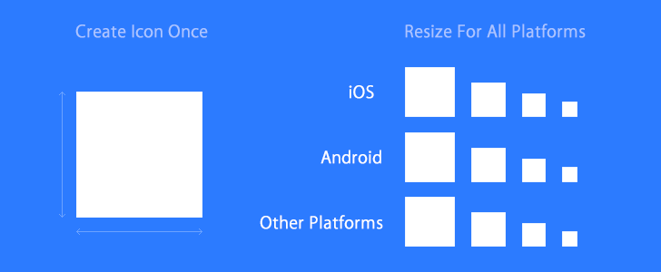

# cordova-icon

Automatic icon resizing for Cordova. Create an icon in the root folder of your Cordova project and use cordova-icon to automatically resize and copy it for all the platforms your project supports (currenty works with iOS, Android and Windows 10).

### Installation

     $ sudo npm install cordova-icon -g

### Requirements

- ImageMagick installed (*Mac*: `brew install imagemagick`, *Debian/Ubuntu*: `sudo apt-get install imagemagick`, *Windows*: [See here](http://www.imagemagick.org/script/binary-releases.php#windows))
- At least one platform was added to your project ([cordova platforms docs](http://cordova.apache.org/docs/en/edge/guide_platforms_index.md.html#Platform%20Guides))
- Cordova's config.xml file must exist in the root folder ([cordova config.xml docs](http://cordova.apache.org/docs/en/edge/config_ref_index.md.html#The%20config.xml%20File))

### Usage

Create an `icon.png` file in the root folder of your cordova project.
You can provide a platform-specific icon by naming it `icon-[platform].png`
(e.g `icon-android.png`, `icon-ios.png`).
Then run:

     $ cordova-icon

You may specify the output path and directory as follows:

    # output to path/to/res/icon
    $ cordova-splash --resource-path path/to/res --icon-dir=icon

WARNING: If you were using a previous version of cordova-icon and expect the generated files to be in their respective ./platforms
path, do not use the --resource-path mode:

    $ cordova-icon

Also if you want to generate icons for an old XCode project structure, use this option:

    $ cordova-icon --xcode-old

This will override the -p and -i settings.

For good results, your file shoud be:

- square
- for Android and iOS, at least 192\*192px (512\*512px recommended to be future-proof)
- for Windows, at least 1240\*1240px

### Creating a cordova-cli hook

Since the execution of cordova-icon is pretty fast, you can add it as a cordova-cli hook to execute before every build.
To create a new hook, go to your cordova project and run:

    $ mkdir hooks/after_prepare
    $ vi hooks/after_prepare/cordova-icon.sh

Paste the following into the hook script:

    #!/bin/bash
    cordova-icon

Then give the script +x permission:

    $ chmod +x hooks/after_prepare/cordova-icon.sh

That's it. Now every time you `cordova build`, the icons will be auto generated.

### Splash screens

Check out [cordova-splash](https://github.com/AlexDisler/cordova-splash)

### More

- [cordova-plugin-inapppurchase](https://github.com/AlexDisler/cordova-plugin-inapppurchase) - a lightweight cordova plugin for in app purchases on iOS/Android
- [ng-special-offer](https://github.com/AlexDisler/ng-special-offer) - prompt users to rate your cordova app in the app store
- [ionic-lock-screen](https://github.com/AlexDisler/ionic-lock-screen) - passcode lock screen for ionic (with touch id support for iOS)
- [ionic-zoom-view](https://github.com/AlexDisler/ionic-zoom-view) - an easy way to add a zoom view to images using an ionic modal
- [ng-persist](https://github.com/AlexDisler/ng-persist) - store data on mobile devices (using cordova) that persists even if the user reinstalls the app

### License

MIT
